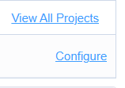
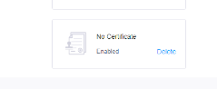

# important - make sure na naka on ung xampp(apache and sql)
# Sql help
1. open localhost/phpmyadmin
2. import mo ung file ./database/petconnect.sql

#Php help
1. Download composer(<a href="https://www.youtube.com/watch?v=yCXfFZljKy8&ab_channel=Cairocoders">follow this kung may xampp ka </a>)
2. type sa cmd(make sure na nasa working folder ka/vscode tas naka open ung project)
```
composer install
```
```
composer update
```
```
composer dump-autoload
```

# npm
1. download node js
2. run "npm install"
3. run "npm run dev"


# setup - env
1. ayoko mag share ng agora id + cert; dahil may bayad gawa kayo account
2. copy paste ung file ng ".env.example"
3. may lilitaw bago ".env copy.example"
4. rename mo yon ng ".env"
5. mayroon ka ng .env at need mo ifill up ung mga laman niya
6. sign up/login ka sa agora
7. kunin mo ung app id at app cert don sa configure


8. katapos mong copy paste sa env ung app id at app cert mo.
9. delete mo ung no certifcate sa baba kung saan mo kinuha ung app cert mo(make sure to save)

10. good to go kana non